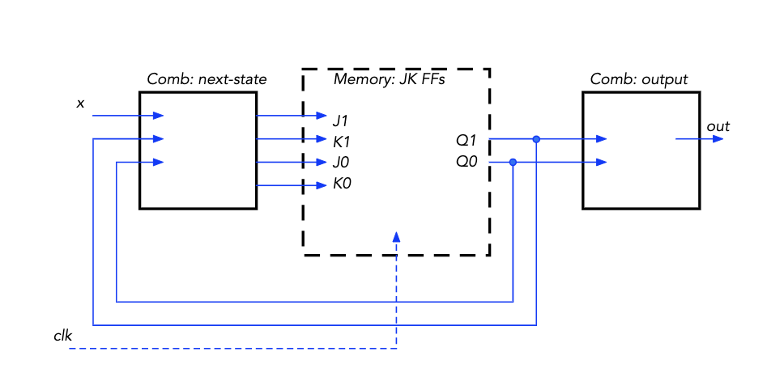
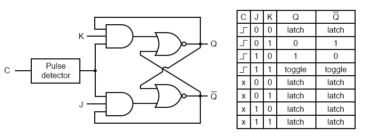
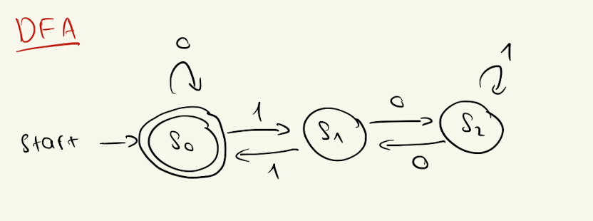
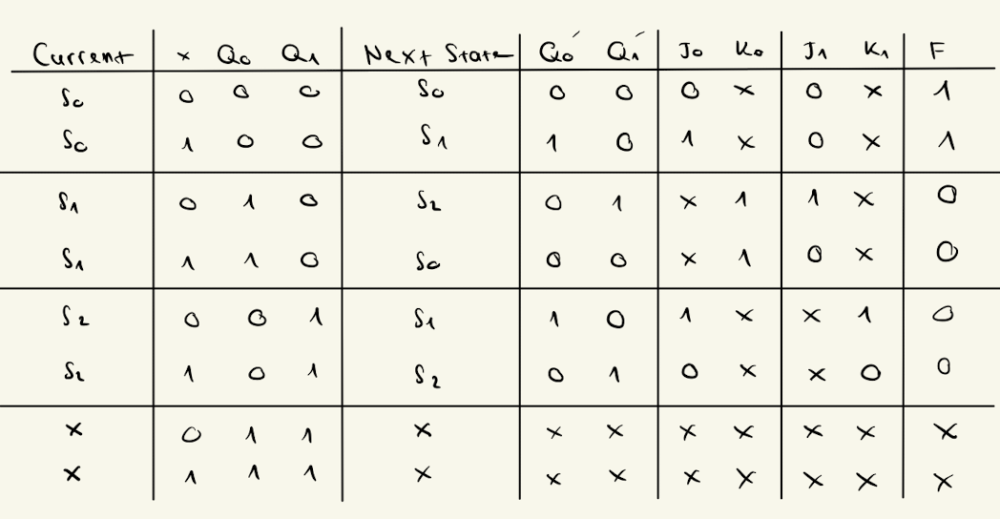

# Lab 5: Finite State Machine Design

## What We Did In The Last Lab

In our previous lab, we delved into the integration of microcontrollers, sensors, and actuators, expanding our understanding of digital circuitry. We explored components like the buzzer and ultrasonic sensor, mastering techniques to control them using Arduino microcontrollers. Through practical experiments, we learned to modulate sound intensity with the buzzer and accurately measure distances with the ultrasonic sensor. Finally, we applied this knowledge to a design challenge, creating a handheld distance detector. This lab emphasized the practical application of engineering principles in real-world scenarios. For more information regarding Lab 4's contents, please refer to this [URL](https://github.com/mlcourses/lab-4-blog-post-Giabao252/blob/main/post.md).

## Overview and Motivation

This lab introduces the details of Finite State Machine (FSM) design, a fundamental concept in computer systems. The lab's primary objective is to construct a circuit capable of determining whether a binary number is divisible by three. This task involves simulating a sequential system that processes incoming binary digits one at a time and analyzes their collective value to ascertain divisibility. Through this exercise, we will gain valuable insights into FSMs, learning how to map out state transitions into state tables and implement combinational logic to drive the system's behavior. By engaging in this hands-on exploration, we will deepen our understanding of sequential circuits and enhance our problem-solving skills in digital design.

## Lab Objectives

1. Design a Finite State Machine (DFA - Deterministic Finite Automata) using a state transition diagram that allows us to construct different binary strings which are divisible by 3.

2. Determine the number of JK Flip Flops needed for the amount of states our FSM has.

3. Design the logic for the two combinational circuits needed in our FSM design above.

4. Create a Function Table and use K-Maps for each output values to determine the boolean expressions needed for our combinational circuits. 

5. Build and Test the circuit in logisim.

6. Build the circuit on the PB-503 breadboard with a JK Flip Flop IC and the other logic gates that we already used.

## Materials

- PB-503 breadboard prototyping station

- 7404 NOT gate IC

- 7408 AND gate IC

- 7486 XOR gate IC

- 7476 JK Flip Flop IC

- IC data sheets

- Wires and connection tools

- Logic Probes

- Logic Switches

- Push Button

- Resistors 

## Project Steps

### Understanding the JK Flip Flop

- Firstly, we have to know that JK Flip Flop is a sequential circuit. Sequential circuits, unlike combinational circuits, incorporate memory elements to store information temporarily. Imagine a road with traffic lights: while combinational circuits act like traffic signals, instantly responding to inputs and changing lights accordingly (green to red, for instance), sequential circuits behave more like a traffic signal with memory. They retain their current state until new input triggers a change, similar to how a traffic light remains red until a timer expires or a sensor detects a vehicle. In essence, sequential circuits can remember past states and produce outputs based not only on current inputs but also on their internal state or history

- JK Flip Flops can be implemented with the following logics:

    + If we want the device to store 0, we set J to 0, and K to 1.
    + If we want the device to store 1, we set J to 1, and K to 0.
    + f we want the device to maintain the previously stored value acress a clock transition, we set both J and K to 0. 

 

- In this lab, we are using the 7476 JKFF chip, featuring a **negative-edge-triggered**. This means the point in time when a flip-flop may take on a new value occurs on the falling edge of the clock. 

### Designing a DFA For The Finite State Machine

- A DFA, or Deterministic Finite Automaton, is like a machine with specific states it can be in. It moves from one state to another based on inputs it receives. Each transition is determined by a clear set of rules, making its behavior predictable and precise. It's a fundamental concept used in computer science to model and solve various problems efficiently.

- For this step, we have to design a DFA that allows us to construct different binary strings which are divisible by 3. Since we are dealing with binary strings, our inputs that determines the state are only 0s and 1s. Each state must have an instruction for both inputs, otherwise it will not be deterministic. 

- Below is the DFA that we have constructed:

 

- Our DFA has three states in total, so we would need 2 JK Flip Flops to be able to represent all three states. This is because if we use 1 flip flop , we could only represent 2 states. 

### Constructing the Function Table

- This step is to specify the actual before and after values for all the combination of signals in the circuit, especially the JK flip flops. This includes the detail of what signals to send to each JK flip flop as the J and K inputs so that the flip-flop output value on the next clock cycle represents the correct next-state value. 

- The table is divided into three main sections: 
    + Left side: information regarding the current state and current input combination for x. 
    + Middle: information regarding the next state and the control inputs for the JK flip-flops that cause this next state to happen correctly. 
    + Right side: desired output F based on the current state.

- Our Function Table will look like this:

 

## Testing

## Conclusion

